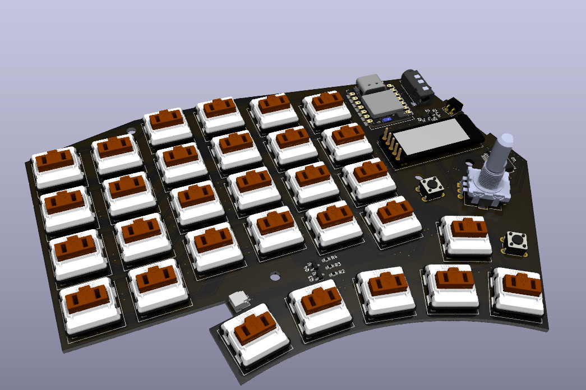

# Dodo

Dodo is a 60%, low-profile, wireless mechanical keyboard with per-key RGB
backlighting a display and a rotary encoder.

## BOM

To build the PCB, you will need the following components for each side (so make
sure to get double of each):

| Part                              | Count | Link                                                                |
| --------------------------------- | ----: | ------------------------------------------------------------------- |
| B5817W Diode                      |     1 | [AliExpress](https://www.aliexpress.com/item/1005005615035910.html) |
| SK6812 MINI-E 1        |    30 | [AliExpress](https://www.aliexpress.com/item/1005005248164351.html) |
| 1N4148 SOD-123                    |    30 | [AliExpress](https://www.aliexpress.com/item/1005005271390029.html) |
| SMD 3.5 mm jack 2      |     1 | [AliExpress](https://www.aliexpress.com/item/4000661908135.html)    |
| 2 pin POGO connector 2 |     1 | [AliExpress](https://www.aliexpress.com/item/1005002006325514.html) |
| AO3401A 1              |     2 | [AliExpress](https://www.aliexpress.com/item/4001197981239.html)    |
| 2N7002 1               |     1 | [AliExpress](https://www.aliexpress.com/item/1005004759627915.html) |
| 10k Ω 0603 resistor 1  |     3 | [AliExpress](https://www.aliexpress.com/item/1005006142628179.html) |
| 560 Ω 0603 resistor 1  |     2 | [AliExpress](https://www.aliexpress.com/item/1005006142628179.html) |
| Momentary tactile switch          |     2 | [AliExpress](https://www.aliexpress.com/item/1005004159746274.html) |
| EC11E style encoder 3  |     1 | [AliExpress](https://www.aliexpress.com/item/1005002358274622.html) |
| Kailh Choc V1                     |    30 | [AliExpress](https://www.aliexpress.com/item/1005004522163996.html) |
| XIAO BLE 4             |     1 | [AliExpress](https://www.aliexpress.com/item/1005004459618789.html) |
| MCP23S17SS                        |     1 | [AliExpress](https://www.aliexpress.com/item/1005004925908454.html) |
| nice!view 5            |     1 | [Official nice!view site](https://nicekeyboards.com/nice-view/)     |
| SMD JST SH connector              |     1 | [AliExpress](https://www.aliexpress.com/item/1005005682408443.html) |

All links are examples, I recommend looking around for better orders, and
especially switches that you like

1: The following components can be omitted, if you don't want RGB: SK6812
MINI-E, 1xAO3401A, 2N7002, 2x10k resistor, 1x560R resistor

2: These are for power delivery (only!) between the halves, so you can charge
them at the same time, but they are technically optional

3: Optional, if you don't need an encoder

4: You might find these as "XIAO NRF52840" or similar. There is also a sense
variant which is more expensive and not necessary

5: Optional, if you don't need a display
